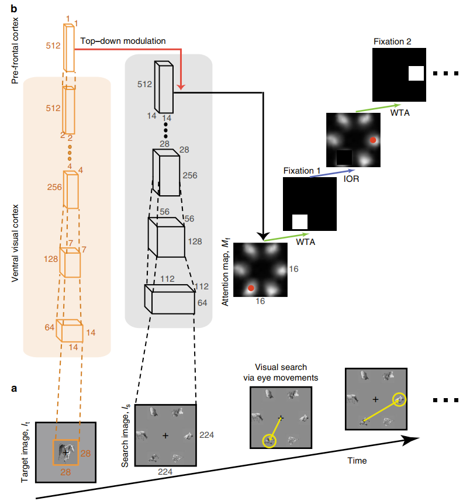

# <p align=center> Finding any Waldo with zero-shot invariant and efficient visual search</p>
 

This is the official PyTorch codes for the paper.  
>Zhang, Mengmi, et al. "Finding any Waldo with zero-shot invariant and efficient visual search." Nature communications 9.1 (2018): 3730.

## Abstract
Searching for a target object in a cluttered scene constitutes a fundamental challenge in daily vision. Visual search must be selective enough to discriminate the target from distractors, invariant to changes in the appearance of the target, efficient to avoid exhaustive exploration of the image, and must generalize to locate novel target objects with zero-shot training. Previous work on visual search has focused on searching for perfect matches of a target after extensive category-specific training. Here, we show for the first time that humans can efficiently and invariantly search for natural objects in complex scenes. To gain insight into the mechanisms that guide visual search, we propose a biologically inspired computational model that can locate targets without exhaustive sampling and which can generalize to novel objects. The model provides an approximation to the mechanisms integrating bottom-up and top-down signals during search in natural scenes.

<div align="center">

</div>


## Citation
If you find our repo useful for your research, please cite us:
```
@article{zhang2018finding,
  title={Finding any Waldo with zero-shot invariant and efficient visual search},
  author={Zhang, Mengmi and Feng, Jiashi and Ma, Keng Teck and Lim, Joo Hwee and Zhao, Qi and Kreiman, Gabriel},
  journal={Nature communications},
  volume={9},
  number={1},
  pages={3730},
  year={2018},
  publisher={Nature Publishing Group UK London}
}
```

## License
Licensed under a [Creative Commons Attribution-NonCommercial 4.0 International](https://creativecommons.org/licenses/by-nc/4.0/) for Non-commercial use only.
Any commercial use should get formal permission first.

